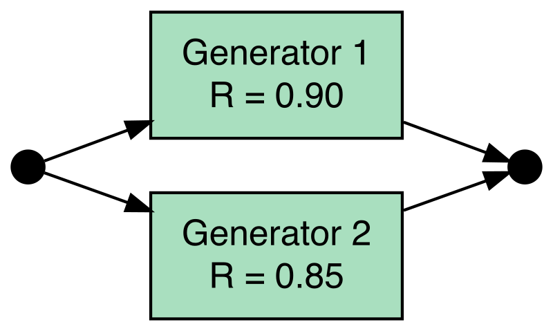
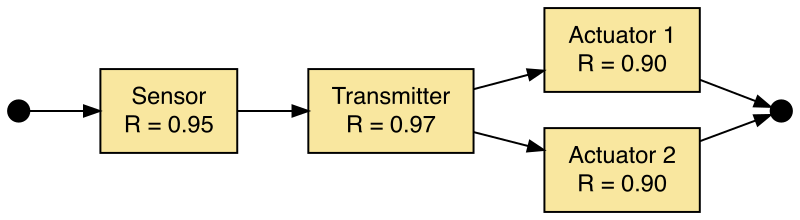
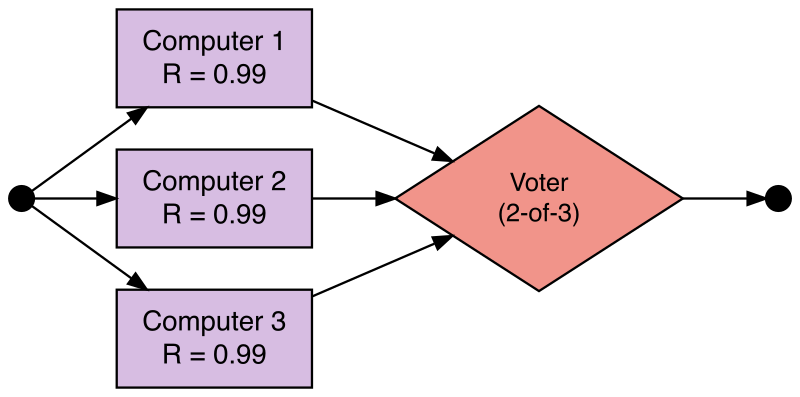
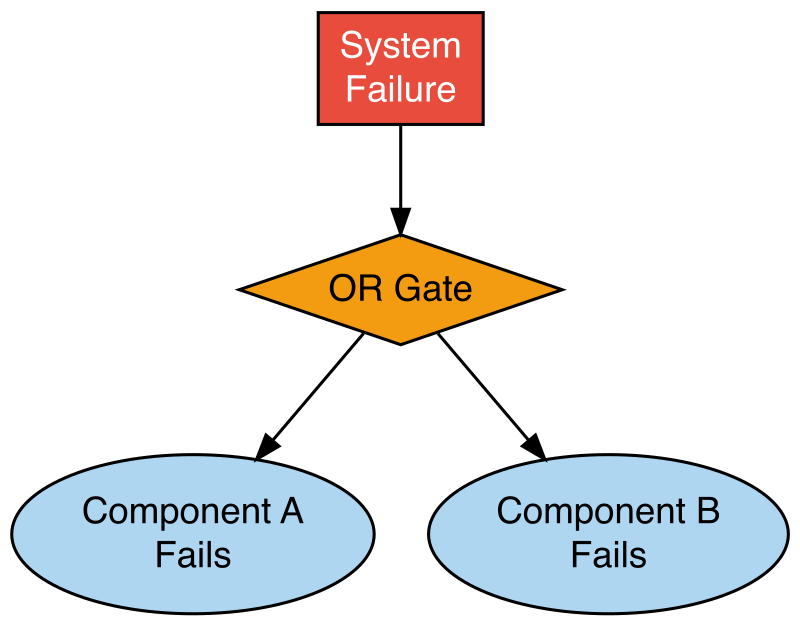

# Reliability Block Diagrams {#sec-rbd}

## Introduction

In @sec-ram, you learned to calculate reliability metrics for individual components. This chapter extends those concepts to *systems*, collections of components whose arrangement determines whether the system succeeds or fails.

A **Reliability Block Diagram (RBD)** is a graphical tool for modeling how component reliabilities combine to produce system-level reliability. RBDs are widely used in reliability engineering to analyze designs, identify vulnerabilities, and evaluate the benefit of redundancy [@Billinton1992].

## Learning Objectives

By the end of this chapter, you will be able to:

- Define reliability block diagrams and relate them to physical systems.
- Compute system reliability for series, parallel, and mixed configurations.
- Interpret k-out-of-n (voting) systems and calculate their reliability.
- Describe the relationship between RBDs and Fault Tree Analysis.
- Apply RBD calculations to a realistic multi-component system.

## What is a Reliability Block Diagram?

An RBD represents each component as a **block** with a known reliability value. Blocks are connected by lines showing logical dependencies, not physical connections. A path from left (input) to right (output) through functioning blocks represents a working system.

Each block has a reliability $R_i(t)$ derived from the exponential model (@sec-ram) or a Weibull fit (@sec-lda).

```{r}
#| message: false
library(DiagrammeR)
```

```{r}
#| include: false
# Generate static PNG fallbacks for PDF/EPUB output if not yet present
imgs <- c(
  "images/rbd-series.png",
  "images/rbd-parallel.png",
  "images/rbd-mixed.png",
  "images/rbd-koon.png",
  "images/rbd-faulttree.png"
)
if (any(!file.exists(imgs))) {
  library(DiagrammeRsvg)
  library(rsvg)
  save_diagram <- function(dot_src, path) {
    svg <- DiagrammeRsvg::export_svg(grViz(dot_src))
    rsvg::rsvg_png(charToRaw(svg), path, width = 800)
  }
  save_diagram('digraph series {
    rankdir = LR
    graph [bgcolor = transparent]
    node [shape = rectangle, style = filled, fillcolor = "#AED6F1",
          fontname = "sans-serif", fontsize = 12, margin = "0.2,0.1"]
    edge [arrowsize = 0.8]
    I [shape = point, width = 0.15, fillcolor = black]
    A [label = "Motor\nR = 0.95"]
    B [label = "Pump\nR = 0.90"]
    C [label = "Valve\nR = 0.98"]
    O [shape = point, width = 0.15, fillcolor = black]
    I -> A -> B -> C -> O
  }', "images/rbd-series.png")
  save_diagram('digraph parallel {
    rankdir = LR
    graph [bgcolor = transparent]
    node [shape = rectangle, style = filled, fillcolor = "#A9DFBF",
          fontname = "sans-serif", fontsize = 12, margin = "0.2,0.1"]
    edge [arrowsize = 0.8]
    I [shape = point, width = 0.15, fillcolor = black]
    A [label = "Generator 1\nR = 0.90"]
    B [label = "Generator 2\nR = 0.85"]
    O [shape = point, width = 0.15, fillcolor = black]
    I -> A -> O
    I -> B -> O
  }', "images/rbd-parallel.png")
  save_diagram('digraph mixed {
    rankdir = LR
    graph [bgcolor = transparent]
    node [shape = rectangle, style = filled, fillcolor = "#F9E79F",
          fontname = "sans-serif", fontsize = 12, margin = "0.2,0.1"]
    edge [arrowsize = 0.8]
    I  [shape = point, width = 0.15, fillcolor = black]
    S  [label = "Sensor\nR = 0.95"]
    T  [label = "Transmitter\nR = 0.97"]
    A1 [label = "Actuator 1\nR = 0.90"]
    A2 [label = "Actuator 2\nR = 0.90"]
    O  [shape = point, width = 0.15, fillcolor = black]
    I -> S -> T -> A1 -> O
    T -> A2 -> O
  }', "images/rbd-mixed.png")
  save_diagram('digraph koon {
    rankdir = LR
    graph [bgcolor = transparent]
    node [shape = rectangle, style = filled, fillcolor = "#D7BDE2",
          fontname = "sans-serif", fontsize = 12, margin = "0.2,0.1"]
    edge [arrowsize = 0.8]
    I  [shape = point, width = 0.15, fillcolor = black]
    C1 [label = "Computer 1\nR = 0.99"]
    C2 [label = "Computer 2\nR = 0.99"]
    C3 [label = "Computer 3\nR = 0.99"]
    V  [label = "Voter\n(2-of-3)", shape = diamond,
        fillcolor = "#F1948A", fontsize = 11]
    O  [shape = point, width = 0.15, fillcolor = black]
    I -> C1 -> V
    I -> C2 -> V
    I -> C3 -> V
    V -> O
  }', "images/rbd-koon.png")
  save_diagram('digraph fta {
    rankdir = TB
    graph [bgcolor = transparent]
    node [fontname = "sans-serif", fontsize = 12, style = filled]
    edge [arrowsize = 0.8]
    Top [label = "System\nFailure",  shape = rectangle,
         fillcolor = "#E74C3C", fontcolor = white]
    OR  [label = "OR Gate", shape = diamond, fillcolor = "#F39C12"]
    F1  [label = "Component A\nFails", shape = ellipse,
         fillcolor = "#AED6F1"]
    F2  [label = "Component B\nFails", shape = ellipse,
         fillcolor = "#AED6F1"]
    Top -> OR
    OR  -> F1
    OR  -> F2
  }', "images/rbd-faulttree.png")
}
```

## Series Systems

In a **series** system, all components must function for the system to succeed:

$$R_{\text{sys}} = R_1 \times R_2 \times \cdots \times R_n = \prod_{i=1}^{n} R_i$$

A series system is *always less reliable* than its weakest component. Adding more components in series can only reduce system reliability.

### Example: Water Pumping System

A pumping system requires a motor (R = 0.95), a pump (R = 0.90), and a control valve (R = 0.98) to all be operational.

::: {.content-visible when-format="html"}
```{r}
grViz("
digraph series {
  rankdir = LR
  graph [bgcolor = transparent]
  node [shape = rectangle, style = filled, fillcolor = '#AED6F1',
        fontname = 'sans-serif', fontsize = 12, margin = '0.2,0.1']
  edge [arrowsize = 0.8]
  I [shape = point, width = 0.15, fillcolor = black]
  A [label = 'Motor\nR = 0.95']
  B [label = 'Pump\nR = 0.90']
  C [label = 'Valve\nR = 0.98']
  O [shape = point, width = 0.15, fillcolor = black]
  I -> A -> B -> C -> O
}
")
```
:::

::: {.content-visible unless-format="html"}
```{r}
#| echo: false
#| fig-cap: "Series RBD: Motor → Pump → Valve (all must work)"

```
:::

```{r}
R_motor <- 0.95
R_pump  <- 0.90
R_valve <- 0.98

R_series <- R_motor * R_pump * R_valve
R_series  # ~0.838
```

The system reliability is approximately 83.8%, lower than any individual component.

::: {.callout-note}
## Try It

A conveyor belt system has 5 components in series with reliabilities 0.98, 0.96, 0.99, 0.94, and 0.97. Calculate the system reliability.

```{r}
R_components <- c(0.98, 0.96, 0.99, 0.94, 0.97)
# R_series <- prod(R_components)
```

<details><summary>Solution</summary>
```{r}
R_components <- c(0.98, 0.96, 0.99, 0.94, 0.97)
R_series <- prod(R_components)
R_series  # ~0.845
```
</details>
:::

::: {.callout-tip}
## Review

In a series system, which component has the greatest influence on system reliability?

<details><summary>Answer</summary>
The **least reliable** component. It is the bottleneck; improving it produces the largest gain in system reliability.
</details>
:::

## Parallel Systems

In a **parallel** system, only one component needs to function, through **active redundancy** (all components operate simultaneously). The system fails *only* if all components fail at the same time. Since component failures are assumed to be independent:

$$P(\text{all fail}) = \prod_{i=1}^{n}(1 - R_i)$$

$$R_{\text{sys}} = 1 - \prod_{i=1}^{n}(1 - R_i)$$

Adding parallel components always increases system reliability.

### Example: Backup Power System

A primary generator (R = 0.90) and a standby generator (R = 0.85); either alone keeps the system running.

::: {.content-visible when-format="html"}
```{r}
grViz("
digraph parallel {
  rankdir = LR
  graph [bgcolor = transparent]
  node [shape = rectangle, style = filled, fillcolor = '#A9DFBF',
        fontname = 'sans-serif', fontsize = 12, margin = '0.2,0.1']
  edge [arrowsize = 0.8]
  I [shape = point, width = 0.15, fillcolor = black]
  A [label = 'Generator 1\nR = 0.90']
  B [label = 'Generator 2\nR = 0.85']
  O [shape = point, width = 0.15, fillcolor = black]
  I -> A -> O
  I -> B -> O
}
")
```
:::

::: {.content-visible unless-format="html"}
```{r}
#| echo: false
#| fig-cap: "Parallel RBD: Generator 1 and Generator 2 (either can work)"

```
:::

```{r}
R_gen1 <- 0.90  # Generator 1
R_gen2 <- 0.85  # Generator 2

R_parallel <- 1 - (1 - R_gen1) * (1 - R_gen2)
R_parallel  # 0.985
```

The parallel system reliability is 98.5%, much higher than either generator alone.

The benefit of redundancy grows with each additional component:

```{r}
n_vals <- 1:8
Rc     <- 0.90
R_par  <- 1 - (1 - Rc)^n_vals

plot(n_vals, R_par, type = "b", col = "steelblue", lwd = 2, pch = 19,
     xlab = "Number of redundant components",
     ylab = "System Reliability",
     main = "Parallel System Reliability vs. Redundancy (R_component = 0.90)",
     ylim = c(0, 1))
abline(h = Rc, col = "gray50", lty = 2)
legend("bottomright",
       legend = c("System reliability", "Single component (0.90)"),
       col = c("steelblue", "gray50"), lty = c(1, 2), pch = c(19, NA), lwd = 2)
```

::: {.callout-note}
## Try It

A critical pump station has 3 pumps in parallel. Each pump has reliability 0.88. What is the system reliability?

```{r}
R_components <- c(0.88, 0.88, 0.88)
# R_parallel <- 1 - prod(1 - R_components)
```

<details><summary>Solution</summary>
```{r}
R_components <- c(0.88, 0.88, 0.88)
R_parallel <- 1 - prod(1 - R_components)
R_parallel  # ~0.9983
```
</details>
:::

## Mixed Systems

Most real systems combine series and parallel blocks. To analyze a **mixed** system, decompose it into subsystems and apply series and parallel rules step by step, working from the innermost blocks outward.

### Example: Safety System

- **Subsystem A**: a sensor (R = 0.95) and a transmitter (R = 0.97) in series.
- **Subsystem B**: two redundant actuators (each R = 0.90) in parallel.
- Subsystems A and B in series (both must work).

::: {.content-visible when-format="html"}
```{r}
grViz("
digraph mixed {
  rankdir = LR
  graph [bgcolor = transparent]
  node [shape = rectangle, style = filled, fillcolor = '#F9E79F',
        fontname = 'sans-serif', fontsize = 12, margin = '0.2,0.1']
  edge [arrowsize = 0.8]
  I [shape = point, width = 0.15, fillcolor = black]
  S [label = 'Sensor\nR = 0.95']
  T [label = 'Transmitter\nR = 0.97']
  A1 [label = 'Actuator 1\nR = 0.90']
  A2 [label = 'Actuator 2\nR = 0.90']
  O [shape = point, width = 0.15, fillcolor = black]
  I -> S -> T -> A1 -> O
  T -> A2 -> O
}
")
```
:::

::: {.content-visible unless-format="html"}
```{r}
#| echo: false
#| fig-cap: "Mixed RBD: Sensor–Transmitter in series, Actuators 1 & 2 in parallel"

```
:::

```{r}
# Subsystem A (series)
R_A <- 0.95 * 0.97
R_A

# Subsystem B (parallel)
R_B <- 1 - (1 - 0.90) * (1 - 0.90)
R_B

# Overall system (A and B in series)
R_system <- R_A * R_B
R_system
```

::: {.callout-tip}
## Review

A system has two subsystems in series. Subsystem 1 has two components in parallel (each R = 0.85); Subsystem 2 is a single component with R = 0.92. What is the system reliability?

<details><summary>Answer</summary>
$R_{\text{sub1}} = 1 - (1 - 0.85)^2 = 0.9775$. $R_{\text{sys}} = 0.9775 \times 0.92 \approx 0.899$.
</details>
:::

## k-out-of-n Systems

A **k-out-of-n** system succeeds if at least $k$ of its $n$ identical components function:

- $k = n$: all must work → series.
- $k = 1$: at least one works → parallel.
- $1 < k < n$: voting or load-sharing system.

The reliability of a k-out-of-n system (identical components, each with reliability $p$) follows the binomial distribution:

$$R_{k/n} = \sum_{i=k}^{n} \binom{n}{i} p^i (1-p)^{n-i} = 1 - \text{pbinom}(k-1,\, n,\, 1-p)$$

The compact R expression counts the probability that *at least* $k$ components function: `pbinom(k-1, n, 1-p)` gives the probability that $k-1$ or fewer components work (i.e., the system fails), and we subtract that from 1.

### Example: Flight Control Computers

A 2-out-of-3 voter: at least 2 of 3 computers must agree. Each computer has R = 0.99.

::: {.content-visible when-format="html"}
```{r}
grViz("
digraph koon {
  rankdir = LR
  graph [bgcolor = transparent]
  node [shape = rectangle, style = filled, fillcolor = '#D7BDE2',
        fontname = 'sans-serif', fontsize = 12, margin = '0.2,0.1']
  edge [arrowsize = 0.8]
  I  [shape = point, width = 0.15, fillcolor = black]
  C1 [label = 'Computer 1\nR = 0.99']
  C2 [label = 'Computer 2\nR = 0.99']
  C3 [label = 'Computer 3\nR = 0.99']
  V  [label = 'Voter\n(2-of-3)', shape = diamond, fillcolor = '#F1948A', fontsize = 11]
  O  [shape = point, width = 0.15, fillcolor = black]
  I -> C1 -> V
  I -> C2 -> V
  I -> C3 -> V
  V -> O
}
")
```
:::

::: {.content-visible unless-format="html"}
```{r}
#| echo: false
#| fig-cap: "k-out-of-n RBD: 2-of-3 voting system with three computers"

```
:::

```{r}
n <- 3      # total components
k <- 2      # minimum required
p <- 0.99   # individual reliability

R_voting <- 1 - pbinom(k - 1, n, 1 - p)
R_voting  # 0.9997
```

::: {.callout-note}
## Try It

A 3-out-of-5 redundant sensor array. Each sensor has reliability p = 0.95. Calculate the system reliability.

```{r}
n <- 5
k <- 3
p <- 0.95
# R_sys <- 1 - pbinom(k - 1, n, 1 - p)
```

<details><summary>Solution</summary>
```{r}
n <- 5
k <- 3
p <- 0.95
R_sys <- 1 - pbinom(k - 1, n, 1 - p)
R_sys  # ~0.9988
```
</details>
:::

## System MTTF

For a **series** system of components with constant failure rates, the system failure rate equals the sum of component failure rates:

$$\lambda_{\text{sys}} = \sum_{i=1}^{n} \lambda_i \qquad \text{MTTF}_{\text{sys}} = \frac{1}{\lambda_{\text{sys}}}$$

For $n$ identical parallel components each with failure rate $\lambda$:

$$\text{MTTF}_{\text{parallel}} = \frac{1}{\lambda}\left(1 + \frac{1}{2} + \frac{1}{3} + \cdots + \frac{1}{n}\right)$$

### Example: Two Pumps in Parallel

```{r}
lambda <- 0.01  # failures per hour

MTTF_single   <- 1 / lambda
MTTF_parallel <- (1 / lambda) * (1 + 1/2)

MTTF_single    # 100 hours
MTTF_parallel  # 150 hours — 50% longer with one spare
```

::: {.callout-tip}
## Review

Three components in series have failure rates 0.02, 0.03, and 0.05 failures/hour. What is the system MTTF?

<details><summary>Answer</summary>
$\lambda_{\text{sys}} = 0.02 + 0.03 + 0.05 = 0.10$, so $\text{MTTF} = 1/0.10 = 10$ hours.
</details>
:::

## Common Cause Failure

All the analyses above assume that component failures are **statistically independent**: if Component A fails, it tells us nothing about Component B's probability of failing. In practice, this assumption can break down.

**Common Cause Failure (CCF)** occurs when a single event simultaneously causes multiple components to fail. Typical sources include:

- A shared environment (vibration, temperature, contamination) that degrades all components together
- A common design flaw or manufacturing batch defect
- A maintenance error that affects multiple redundant units at once

CCF is especially dangerous because **redundancy does not protect against it**: if both pumps in a parallel system can be destroyed by the same flooding event, adding a third pump does not help.

### The Beta-Factor Model

The simplest CCF model splits each component's total failure rate $\lambda$ into two parts:

$$\lambda_{\text{ind}} = (1 - \beta_{\text{CCF}}) \cdot \lambda \qquad \text{(independent failures)}$$
$$\lambda_{\text{CCF}} = \beta_{\text{CCF}} \cdot \lambda \qquad \text{(common-cause failures)}$$

The **beta-factor** $\beta_{\text{CCF}}$ is the fraction of failures attributable to common causes. Typical values range from 0.01 (1%) for well-separated, dissimilar components to 0.20 (20%) for closely coupled identical units.

System reliability for a two-component parallel system with CCF:

$$R_{\text{sys}} = \underbrace{\left[1 - (1 - R_{\text{ind}})^2\right]}_{\text{parallel, independent part}} \times \underbrace{e^{-\lambda_{\text{CCF}} \, t}}_{\text{common-cause part}}$$

```{r}
lambda <- 0.001   # total component failure rate (per hour)
t      <- 1000    # mission time (hours)

beta_vals <- c(0, 0.05, 0.10, 0.20)

results <- sapply(beta_vals, function(b) {
  R_ind <- exp(-(1 - b) * lambda * t)   # independent reliability
  R_ccf <- exp(-b * lambda * t)         # common-cause reliability
  R_sys <- (1 - (1 - R_ind)^2) * R_ccf
  round(R_sys, 4)
})

data.frame(beta_CCF = beta_vals, R_system = results)
```

Even a modest $\beta_{\text{CCF}} = 0.10$ visibly reduces the system reliability that redundancy would otherwise provide.

::: {.callout-tip}
## Review

Why doesn't adding more parallel components help when $\beta_{\text{CCF}}$ is large?

<details><summary>Answer</summary>
When $\beta_{\text{CCF}}$ is large, a significant fraction of failures are **common cause**, simultaneously affecting all components regardless of how many there are. Adding more identical, coupled components may even increase the common-cause failure rate if they share the same environment or design flaw. Effective mitigation requires **diversity** (different designs, manufacturers, or locations) rather than simple redundancy.
</details>
:::

CCF data and beta-factor values for different equipment types are tabulated in IEC 61508 (functional safety) and MIL-HDBK-217F (electronic reliability). For nuclear applications, the NUREG/CR-5497 handbook provides detailed CCF databases.

## Introduction to Fault Tree Analysis

**Fault Tree Analysis (FTA)** [@Vesely1981] is a top-down approach that starts with an undesirable event (the **top event**) and works backward to identify combinations of component failures that could cause it.

While an RBD asks "What must work for the system to succeed?", a fault tree asks "What can cause the system to fail?"

### Gates

- **AND gate**: top event occurs only if *all* inputs occur, corresponding to **parallel** RBD components (all must fail).
- **OR gate**: top event occurs if *any* input occurs, corresponding to **series** RBD components (any failure causes system failure).

### RBD—Fault Tree Duality

| RBD configuration | Fault tree gate for system failure |
|:---:|:---:|
| Series (all must work) | OR gate (any failure causes system failure) |
| Parallel (any can work) | AND gate (all must fail for system failure) |

::: {.content-visible when-format="html"}
```{r}
grViz("
digraph fta {
  rankdir = TB
  graph [bgcolor = transparent]
  node [fontname = 'sans-serif', fontsize = 12, style = filled]
  edge [arrowsize = 0.8]
  Top [label = 'System\nFailure',  shape = rectangle, fillcolor = '#E74C3C', fontcolor = white]
  OR  [label = 'OR Gate',          shape = diamond,   fillcolor = '#F39C12']
  F1  [label = 'Component A\nFails', shape = ellipse, fillcolor = '#AED6F1']
  F2  [label = 'Component B\nFails', shape = ellipse, fillcolor = '#AED6F1']
  Top -> OR
  OR  -> F1
  OR  -> F2
}
")
```
:::

::: {.content-visible unless-format="html"}
```{r}
#| echo: false
#| fig-cap: "Fault Tree: OR gate — system failure if Component A or B fails"

```
:::

This OR gate corresponds to a two-component series RBD: any single failure causes system failure. For complex fault trees, the R package `FaultTree` on CRAN provides computational support.

::: {.callout-tip}
## Review

A fault tree has an AND gate combining two component failures. Which RBD configuration does this correspond to?

<details><summary>Answer</summary>
**Parallel**: an AND gate means the system fails only if both components fail simultaneously, which is exactly the parallel (redundant) configuration.
</details>
:::

## Case Study: Industrial Cooling System

An industrial cooling system has the following architecture:

1. **Water supply subsystem**: two pumps in parallel (each R = 0.92), followed by a filter in series (R = 0.99).
2. **Control subsystem**: a primary controller (R = 0.97) and a backup controller in parallel (R = 0.95).
3. Both subsystems must work (series at system level).

```{r}
# Step 1 — Water supply subsystem
R_pump_parallel <- 1 - (1 - 0.92)^2
R_water <- R_pump_parallel * 0.99
R_water

# Step 2 — Control subsystem
R_control <- 1 - (1 - 0.97) * (1 - 0.95)
R_control

# Step 3 — Overall system (both subsystems in series)
R_system <- R_water * R_control
R_system
```

::: {.callout-note}
## Try It

Modify the case study: the filter is upgraded to R = 0.999. Recalculate the system reliability.

```{r}
R_pump1  <- 0.92
R_pump2  <- 0.92
R_filter <- 0.999   # upgraded from 0.99
R_ctrl1  <- 0.97
R_ctrl2  <- 0.95
```

<details><summary>Solution</summary>
```{r}
R_pump1  <- 0.92
R_pump2  <- 0.92
R_filter <- 0.999
R_ctrl1  <- 0.97
R_ctrl2  <- 0.95

R_pump_parallel <- 1 - (1 - R_pump1) * (1 - R_pump2)
R_water   <- R_pump_parallel * R_filter
R_control <- 1 - (1 - R_ctrl1) * (1 - R_ctrl2)
R_system  <- R_water * R_control
R_system  # ~0.985
```
</details>
:::

## Summary

**Key takeaways:**

- **Series**: $R_{\text{sys}} = \prod R_i$, every component must work; reliability decreases with more components.
- **Parallel**: $R_{\text{sys}} = 1 - \prod(1-R_i)$, redundancy; only one component needs to work.
- **Mixed**: decompose into subsystems, apply formulas step by step.
- **k-out-of-n**: `1 - pbinom(k-1, n, 1-p)` for voting/load-sharing systems.
- **Series MTTF**: $1/\sum\lambda_i$; **Parallel MTTF**: $(1/\lambda)\sum_{i=1}^{n}(1/i)$.
- **Common Cause Failure**: redundancy requires *diversity* to be effective; the $\beta_{\text{CCF}}$ factor quantifies the fraction of failures caused by shared events, and adding more identical, coupled components does not protect against CCF.
- **FTA duality**: series RBD ↔ OR gate; parallel RBD ↔ AND gate.

