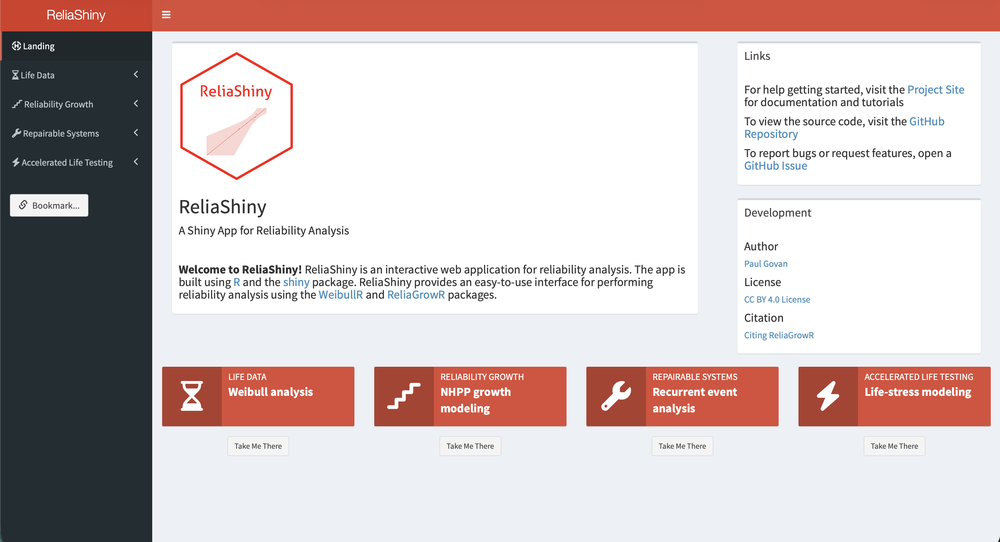
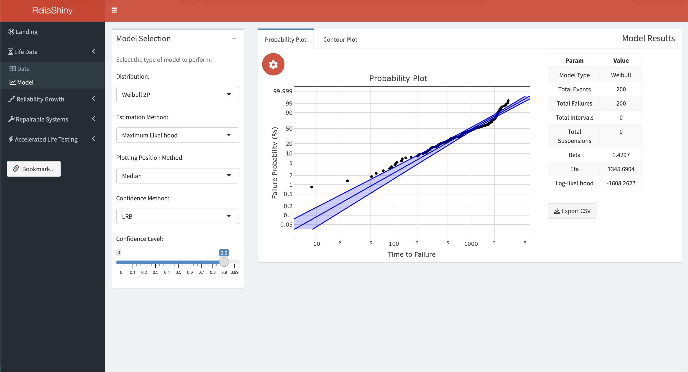
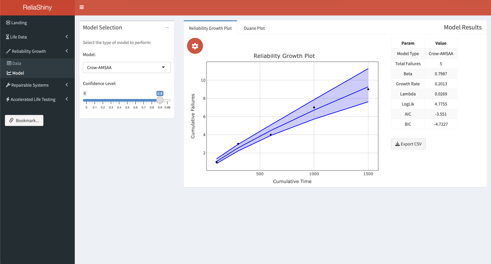
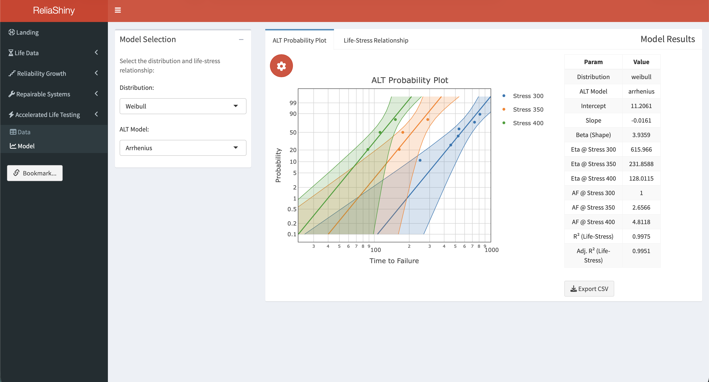
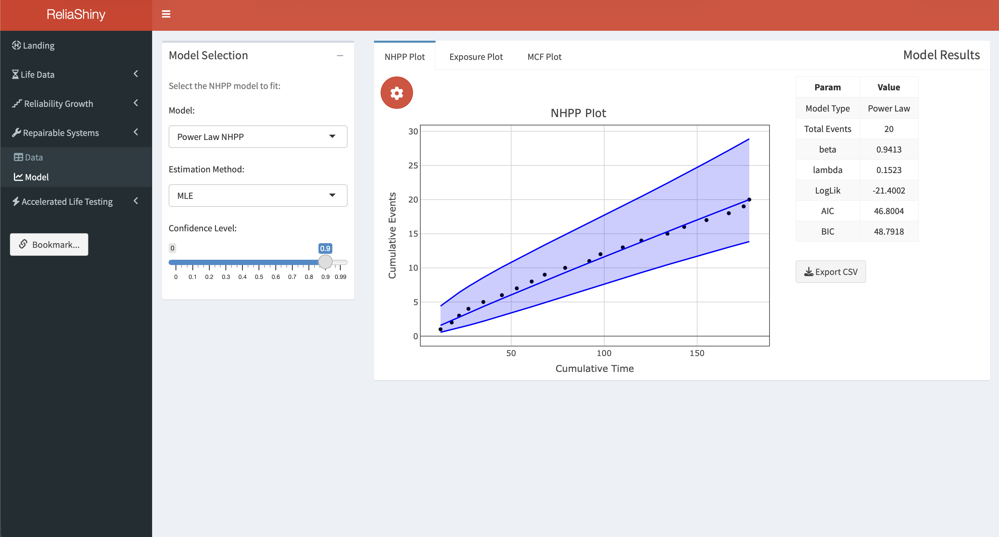

# Web-Based Analysis with ReliaShiny {#sec-reliashiny}

## Introduction

All of the analyses in this book require writing R code. **ReliaShiny** [@ReliaShiny] removes that requirement — it is a point-and-click Shiny [@shiny] web application that exposes the same reliability analysis workflows (RAM, life data analysis, reliability testing, repairable systems, reliability block diagrams) through a graphical interface. No R programming knowledge is needed to run an analysis.

This chapter introduces ReliaShiny, tours its modules, and explains when to reach for it versus a scripted R workflow.

## Installation and Launch

ReliaShiny is available on CRAN:

```{r}
#| eval: false
install.packages("ReliaShiny")
```

Once installed, launch the app from the R console:

```{r}
#| eval: false
library(ReliaShiny)
ReliaShiny()
```

This opens the application in your default web browser. The app runs locally — no internet connection or account is required.

## App Overview

When ReliaShiny opens, the left sidebar displays the available analysis modules, each corresponding to a chapter in this book:

{fig-alt="ReliaShiny web app with a left sidebar listing modules: RAM, Life Data Analysis, Reliability Growth, Accelerated Life Testing, Repairable Systems, and Reliability Block Diagrams."}

| Module | Corresponding chapter | Key capabilities |
|---|---|---|
| **RAM** | @sec-ram | Reliability, availability, MTTF, MTBF, failure rate |
| **Life Data Analysis** | @sec-lda | 2-parameter, 3-parameter Weibull, Weibayes; MRR and MLE; right-censored data |
| **Reliability Growth** | @sec-rt | Duane and Crow-AMSAA model fitting; piecewise NHPP |
| **Accelerated Life Testing** | @sec-alt | Arrhenius and Power Law models; relationship plots |
| **Repairable Systems** | @sec-rs | Power Law Process (NHPP); MCF; fleet exposure |
| **Reliability Block Diagrams** | @sec-rbd | Series, parallel, mixed, and k-out-of-n configurations |

Each module follows the same three-step workflow:

1. **Input** — enter or upload your data using form fields, tables, or file uploads.
2. **Analyze** — click **Run** to fit the model.
3. **Output** — view plots, parameter estimates, and summary statistics; download results.

## Module Walkthroughs

### RAM Module

The RAM module computes reliability, availability, MTTR, MTTF, MTBF, and failure rate from summary inputs.

**Workflow:**

1. Select the *RAM* tab in the sidebar.
2. Enter the total time, failed time, and (for availability) scheduled maintenance time.
3. Click **Calculate**.
4. The panel displays all five metrics: Reliability, Availability, MTTR, MTTF, MTBF, and Failure Rate.

This mirrors the `rel()`, `avail()`, `mttf()`, `mtbf()`, and `fr()` helper functions from @sec-ram.

### Life Data Analysis Module

The LDA module fits Weibull models and generates probability and contour plots. The app includes a preloaded **Time-to-Failure** dataset so you can explore the workflow immediately without uploading data.

{fig-alt="ReliaShiny Life Data Analysis module with a Weibull probability plot in the main panel and parameter estimates in the sidebar."}

**Workflow:**

1. Select the *Life Data Analysis* tab in the sidebar.
2. Navigate to the **Data** sub-menu. The preloaded *Time-to-Failure* dataset is already loaded — explore additional options for data arrangement or upload your own CSV with columns `time` and `event` (1 = failure, 0 = suspension).
3. Navigate to the **Model** sub-menu. Select the distribution (2-parameter Weibull by default) and estimation method (MRR or MLE).
4. Click **Fit Model**. The **Probability Plot** appears in the main panel, with $\hat{\beta}$, $\hat{\eta}$, and the Anderson-Darling statistic.
5. Switch to the **Contour Plot** tab for an interactive likelihood ratio contour showing the joint confidence region for $\hat{\beta}$ and $\hat{\eta}$.
6. Click **Download Plot** to save the current chart as a PNG.

**CSV format for upload:**

```
time,event
30,1
49,1
82,1
90,1
96,1
100,0
45,0
10,0
```

A `0` in the `event` column marks a suspension (right-censored observation).

See the [Life Data Analysis article](https://paulgovan.github.io/ReliaShiny/articles/LDA.html) for a full walkthrough.

### Reliability Growth Module

The Reliability Growth module fits Crow-AMSAA and Duane reliability growth models. The app includes a preloaded **Simple Data** dataset for immediate exploration.

{fig-alt="ReliaShiny Reliability Growth module displaying a Crow-AMSAA cumulative failures plot with fitted model curve."}

**Workflow:**

1. Select *Reliability Growth* in the sidebar.
2. Navigate to the **Data** sub-menu. The preloaded *Simple Data* dataset is loaded — designate the **failures** column as the failure indicator, or upload your own data.
3. Navigate to the **Model** sub-menu.
4. Click **Fit**. The **Reliability Growth Plot** (Crow-AMSAA cumulative failures) appears with the fitted curve and $\hat{\beta}$.
5. Switch to the **Duane Plot** tab to view the log-log cumulative MTBF plot for the same data.

See the [Reliability Growth Analysis article](https://paulgovan.github.io/ReliaShiny/articles/RGA.html) for a full walkthrough.

### Accelerated Life Testing Module

The ALT module fits Arrhenius and Power Law acceleration models using the `WeibullR.ALT` package (see @sec-alt). The app includes the preloaded **Nelson Data** dataset.

{fig-alt="ReliaShiny Accelerated Life Testing module showing an ALT probability plot with stress-level curves and a life-stress relationship plot."}

**Workflow:**

1. Select *Accelerated Life Testing* in the sidebar.
2. Navigate to the **Data** sub-menu. The preloaded *Nelson Data* is already loaded. Map the columns: select the **Stress Level**, **Time to Failure**, and **Event Indicator** columns from the dropdowns.
3. Navigate to the **Model** sub-menu. Choose the acceleration model (**Arrhenius** for temperature, **Power Law** for voltage/mechanical stress) and distribution (Weibull or Lognormal).
4. Click **Fit ALT Model**. The **ALT Probability Plot** appears, with one curve per stress level.
5. Switch to the **Life-Stress Relationship** tab to view how predicted life varies across the stress range, with percentile lines (P10, P63.2, P90).

See the [Accelerated Life Testing article](https://paulgovan.github.io/ReliaShiny/articles/ALT.html) for a full walkthrough.

### Repairable Systems Module

The Repairable Systems module fits the Power Law Process (Crow-AMSAA) and computes the MCF and exposure for fleet data. The app includes a preloaded **Simple Data Set**.

{fig-alt="ReliaShiny Repairable Systems module displaying an MCF cumulative failures curve with confidence bounds for a fleet of systems."}

**Workflow:**

1. Select *Repairable Systems* in the sidebar.
2. Navigate to the **Data** sub-menu. The preloaded *Simple Data Set* is loaded — map the **System ID**, **Event Time**, and **Event Indicator** columns, or upload your own fleet data with columns `id`, `time`, and `event`.
3. Navigate to the **Model** sub-menu.
4. Click **Analyze**. Three plots are produced:
   - **NHPP Plot** — Crow-AMSAA Power Law fit with cumulative failures curve and $\hat{\beta}$, $\hat{\lambda}$.
   - **Exposure Plot** — fleet-level event rate as a function of operating time.
   - **MCF Plot** — non-parametric Mean Cumulative Function with confidence bounds.

**Example CSV format:**

```
id,time,event
1,310,1
1,850,1
1,1620,1
2,420,1
2,1050,1
2,3000,0
```

The last row for system 2 (`event = 0`) indicates that system 2 was observed until hour 3,000 without a third failure.

See the [Repairable Systems Analysis article](https://paulgovan.github.io/ReliaShiny/articles/RS.html) for a full walkthrough.

### Reliability Block Diagrams Module

The RBD module computes system reliability from component reliabilities for series, parallel, mixed, and k-out-of-n configurations.


**Workflow:**

1. Select *Reliability Block Diagrams*.
2. Choose the system **topology** from the dropdown: Series, Parallel, Mixed, or k-out-of-n.
3. Enter the number of components and their individual reliabilities.
4. For Mixed systems, define subsystem groupings.
5. For k-out-of-n systems, enter $k$ (minimum required) and $n$ (total).
6. Click **Calculate**.
7. System reliability and, for exponential components, system MTTF are displayed.
8. A block diagram graphic is shown for Series and Parallel configurations.

## Data Upload Tips

- **CSV files**: core column names (`time`, `event`, `id`, `qty`) are case-sensitive and must be **lowercase**. Stress column names (e.g., `TempC`, `Voltage`) may use any valid R name — they are selected in the app's dropdown.
- **Missing values**: rows with `NA` in the `time` column are automatically excluded.
- **Large datasets**: the app handles datasets up to ~10,000 rows without performance issues.
- **Units**: ReliaShiny is unit-agnostic — use hours, years, cycles, or any consistent unit. Label your outputs accordingly.

## Downloading Results

Every module provides download buttons for:

- **Plot PNG** — the current chart at screen resolution.
- **Results CSV** — parameter estimates and summary statistics in tabular form.
- **Report HTML** — a self-contained report combining the inputs, plot, and results (available in LDA and RT modules).

## When to Use ReliaShiny vs Scripted R

| Situation | ReliaShiny | Scripted R |
|---|:---:|:---:|
| Quick one-off analysis | ✅ | |
| Teaching / demonstration | ✅ | |
| Sharing with non-R users | ✅ | |
| Automating repeated analyses | | ✅ |
| Custom plots and formatting | | ✅ |
| Reproducible research / version control | | ✅ |
| Embedding results in a Quarto book | | ✅ |
| Large batch processing | | ✅ |

ReliaShiny excels at rapid exploration, prototyping, and sharing results with stakeholders who do not use R. For production workflows, automated pipelines, and fully reproducible analyses, scripted R with the underlying packages (WeibullR, ReliaGrowR, WeibullR.ALT) gives more control.

## Getting Help

Within the app, click the **?** icon on any panel for a tooltip explaining the inputs and outputs for that module.

From R:

```{r}
#| eval: false
help(package = "ReliaShiny")
```

Additional resources:

- CRAN page: <https://CRAN.R-project.org/package=ReliaShiny>
- Articles and walkthroughs: <https://paulgovan.github.io/ReliaShiny/>

## Summary

ReliaShiny provides a point-and-click interface to the full ReliaLearnR analysis ecosystem — RAM, life data analysis, reliability testing, repairable systems, and reliability block diagrams — with no R coding required. Install it with `install.packages("ReliaShiny")` and launch it with `ReliaShiny()`. Use it for rapid exploration, stakeholder demonstrations, and sharing results; switch to scripted R for reproducibility, automation, and custom outputs.

